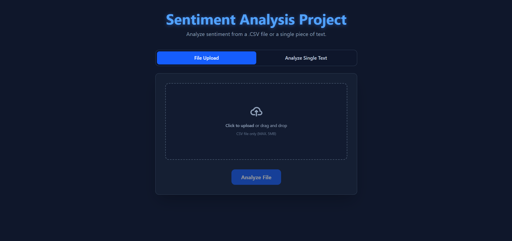

# Sentiment Analysis WebApp

A full-stack web application designed for detailed sentiment analysis. This tool allows users to analyze text sentiment by either uploading a CSV file or inputting text directly. It features a real-time progress bar, dynamic visualizations, and powerful filtering options, all powered by a FastAPI backend and a Hugging Face transformer model.



## ✨ Key Features

- **Dual Analysis Modes:** Analyze text from a **CSV file** or a **single text input**.
- **Dynamic CSV Column Selection:** Automatically reads CSV headers and lets the user choose which column to analyze (no need to rename columns to `text`).
- **Real-time Progress Bar:** Uses **WebSockets** to provide live feedback during CSV processing (Connecting, Reading file, Uploading, Analyzing %).
- **Interactive Data Visualization:**
  - **Pie Chart:** Shows the percentage distribution of sentiments.
  - **Bar Chart:** Displays the exact counts for Positive, Negative, and Neutral.
- **Advanced Results Table:**
  - **Pagination:** Handles large datasets by splitting results into manageable pages (50 rows per page).
  - **Dynamic Filtering:** Filter the table by "All", "Positive", "Negative", or "Neutral" with live count updates on the buttons.
- **Flexible Data Export:** A "Download CSV" dropdown allows exporting _all_ results or _only_ the currently filtered view (e.g., "Download Positive").
- **Responsive UI:** Built with Tailwind CSS for a clean experience on all devices.

## 🚀 Technologies Used

### Backend (`server/`)

- **Python 3**
- **FastAPI:** For the REST API and WebSocket endpoints.
- **Hugging Face `transformers`:** Using the `cardiffnlp/twitter-roberta-base-sentiment` model for state-of-the-art analysis.
- **`pandas`:** For efficient CSV parsing.
- **`uvicorn`:** As the ASGI server.
- **`websockets`:** For real-time progress updates.

### Frontend (`client/`)

- **React** (with Vite)
- **TypeScript**
- **Tailwind CSS:** For all styling.
- **`recharts`:** For the Pie and Bar charts.
- **`axios`:** For the single text analysis API call.

## 🔌 Setup and Local Installation

### Prerequisites

- Node.js (v18+ recommended) and `pnpm`
- Python 3.10+

### 1\. Clone the Repository

```bash
git clone https://github.com/MauryaShiva/sentiment-analysis-webapp.git
cd sentiment-analysis-webapp
```

### 2\. Backend Setup (`server/` folder)

**Open a terminal** in the project's root directory.

```bash
# 1. Go into the server directory
cd server

# 2. Create a Python virtual environment
python -m venv venv

# 3. Activate the environment
# On Windows:
.\venv\Scripts\activate
# On Mac/Linux:
# source venv/bin/activate

# 4. Install all dependencies
pip install -r requirements.txt

# 5. Run the server
# This will also trigger the one-time download of the 500MB AI model
uvicorn main:app --reload
```

Your backend server is now running at `http://localhost:8000`.

### 3\. Frontend Setup (`client/` folder)

**Open a _new_ terminal** in the project's root directory.

```bash
# 1. Go into the client directory
cd client

# 2. Install all dependencies
pnpm install

# 3. Run the development server
pnpm run dev
```

Your React app is now running at `http://localhost:5173`.

**Important:** The frontend is configured to connect to `ws://localhost:8000/ws/analyze/` for local development.

## 🧪 Test Data

[**Click here to download a sample `sentimental.csv` file for testing.**](./sentimental.csv)

## 🖥️ API Endpoints

- **`POST /analyze-text/`**: Analyzes a single JSON text input.
- **`WS /ws/analyze/`**: Handles the CSV file analysis over a WebSocket connection. It expects a JSON payload:
  ```json
  {
    "columnName": "name-of-the-column-to-analyze",
    "csvData": "full-csv-content-as-a-string"
  }
  ```

## 🙏 Acknowledgements

This project uses the powerful `cardiffnlp/twitter-roberta-base-sentiment` model from the [Hugging Face Hub](https://huggingface.co/cardiffnlp/twitter-roberta-base-sentiment).
